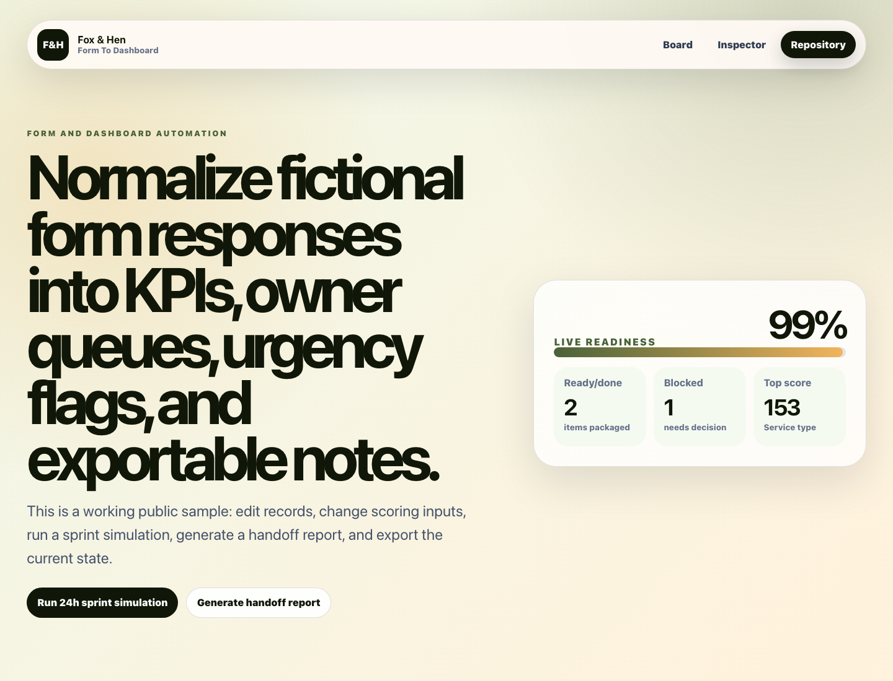

# Form To Dashboard

Public Fox & Hen working sample for a **form and dashboard automation**.



## Live Demo

- Demo: [https://foxhen-form-to-dashboard.vercel.app](https://foxhen-form-to-dashboard.vercel.app)
- Repository: [https://github.com/foxandhenllc/foxhen-form-to-dashboard](https://github.com/foxandhenllc/foxhen-form-to-dashboard)

## What This Demo Is

Form To Dashboard is a forkable React/Vite operating tool for teams that want to normalize fictional form responses into queues, urgency signals, KPI summaries, and weekly notes. It is intentionally small, static, and public-safe so you can copy the pattern without inheriting a backend or vendor lock-in.

## Fully Working Behaviors

- Search, filter, and sort a domain-specific workflow board.
- Add a fictional item and edit owner, notes, priority, value, effort, and friction.
- Advance status and watch readiness metrics update in real time.
- Run a 24-hour sprint simulation to reduce friction on the highest-scoring work.
- Toggle QA gates, generate a handoff report, and download the board as JSON.

## Workflow Template

See [docs/workflow-template.md](docs/workflow-template.md) for the sample intake-to-dashboard loop, adaptation checklist, and public-safe data rules.

## Suggested Forks

- Map your form fields to title, category, owner, due, and notes.
- Treat friction as missing information or manual review cost.
- Use checks as dashboard publishing gates.
- Export JSON for a static dashboard seed or Sheets import.

## Local Run

```bash
npm install
npm run dev
npm run build
```

## Public-Safe Scope

This is a static React/Vite demo with fictional sample data. It includes no production data, credentials, real contacts, copied customer work, backend, auth, or external service calls.
